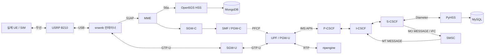

# 구성과 변경 이력

## 목적과 확인 근거

이 저장소는 [herlesupreeth/docker_open5gs](https://github.com/herlesupreeth/docker_open5gs)의 구성을 바탕으로 EPC, IMS, SDR 기반 eNB를 한 PC에서 운용하기 위해 정리한 테스트베드다. 유지보수자는 원본을 사용하며 겪은 단일 PC 충돌을 해결했으며, LTE 접속·IMS 등록·통화·SMS까지 실제 단말로 확인했다고 설명했다.

그 충돌을 고치는 개별 커밋은 이 저장소에 없다. 최초 커밋 `cabd17a`가 이미 정리된 설정 전체를 반입했기 때문이다. 따라서 아래 설명은 **현재 파일에서 확인되는 동작**이다. 특정 설정 하나가 과거 충돌의 유일한 원인이었다거나, 현재 upstream에도 같은 문제가 있다고 단정하지 않는다. 반입에 사용한 `docker_open5gs`의 정확한 커밋도 기록되어 있지 않다.

## 한 PC 안의 네트워크

도식은 주요 경로만 표시한다. DNS, PCRF 정책 제어, 각 CSCF의 MySQL 접근, 일부 제어 연결은 생략했다. 통화의 SIP 제어와 RTP 미디어는 별도 경로이며, SMSC는 `MESSAGE`를 처리한다.

### 주소와 역할

기준값은 [`.env.example`](../.env.example), 배선은 [`docker-compose.yml`](../docker-compose.yml), eNB 실행은 [`pyproject.toml`](../pyproject.toml)에 있다.

| 구성요소 | 기본 IP | 역할 |
|---|---|---|
| mongo / mysql | `172.22.0.2` / `.17` | Open5GS 가입자 / IMS 관련 데이터 |
| hss / pcrf | `.3` / `.4` | LTE 인증 / 정책 제어 |
| sgwc / sgwu | `.5` / `.6` | SGW 제어 / 사용자 평면 |
| smf / upf | `.7` / `.8` | 4G PGW 제어 / 사용자 평면 역할 |
| mme | `.9` | LTE 접속·이동성 제어 |
| dns / rtpengine | `.15` / `.16` | IMS 이름 해석 / 미디어 릴레이 |
| pyhss | `.18` | IMS 인증 및 가입자·iFC API |
| icscf / scscf / pcscf | `.19` / `.20` / `.21` | IMS SIP 제어 |
| webui | `.26` | Open5GS 가입자 관리 UI |
| smsc | `.27` | SMS over IMS 애플리케이션 서버 |
| srsenb | `.50` | SDR를 사용하는 eNodeB |

축약한 IP의 접두사는 모두 `172.22.0`이다. `ENTITLEMENT_SERVER_IP=.30`은 DNS 템플릿에 남아 있는 설정이며, 이 스택에는 entitlement 서버 서비스가 없다.

Docker 네트워크 이름은 `docker_open5gs_default`, Linux bridge 이름은 `br-volte`, 기본 서브넷은 `172.22.0.0/24`다. EPC/IMS는 Compose, eNB는 `poe enb-run`의 별도 `docker run`으로 실행하며 **동일 bridge**에 연결한다. 따라서 `epc-stop`만으로 eNB가 멈추지 않는다.

### 같은 포트를 사용하는 프로세스가 공존하는 이유

각 컨테이너는 별도 네트워크 네임스페이스와 고정 IP를 사용한다. SIP `5060`, Diameter, GTP-U 같은 포트가 서로 다른 컨테이너 IP에 바인딩되는 것은 호스트의 동일 주소·포트 중복 바인딩과 다르다. eNB는 기본적으로 MME와 SGW-U의 bridge IP를 사용한다. 확인할 설정은 다음과 같다.

- [`enb.conf`](../infrastructure/srsenb/enb.conf): `mme_addr`, `gtp_bind_addr`, `s1c_bind_addr`, `s1c_bind_port=0`.
- [`sgwu.yaml`](../infrastructure/sgwu/sgwu.yaml): GTP-U bind 및 `SGWU_ADVERTISE_IP`.
- [`upf.yaml`](../infrastructure/upf/upf.yaml): UPF의 별도 GTP-U 주소, APN별 인터페이스.
- [`pcscf.cfg`](../infrastructure/pcscf/pcscf.cfg): SIP `5060`, IPsec client/server `5100`/`6100`, IPsec forwarding 설정.

`PCSCF_BIND_PORT`는 [`pcscf.xml`](../infrastructure/pcscf/pcscf.xml)의 Diameter acceptor에도 사용된다. 이것을 단순히 “P-CSCF SIP 포트 설정”으로 해석해서 바꾸면 안 된다. SIP listen과 IPsec 포트는 별도 설정이다. 현재 작동 확인된 값을 유지하고, 포트 변경 실험은 관련 프로토콜별로 검증한다.

### 호스트에 공개되는 포트

| 서비스 | 호스트 포트 / 전송 | 목적 |
|---|---|---|
| webui | `9999/tcp` | 가입자 UI |
| pyhss | `8080/tcp` | 관리 API |
| mme | `36412/sctp` | S1AP |
| sgwu | `2152/udp` | GTP-U |
| pcscf | `5060`, `5100`, `6100` 각각 TCP/UDP | SIP / IPsec 관련 소켓 |

`expose`는 호스트 포트 게시가 아니다. 호스트 게시 여부는 Compose의 `ports`를 확인한다. 위 매핑은 호스트 IP 제한 없이 게시되어 있으므로 접근 범위는 실험 호스트의 네트워크·방화벽 설정을 따른다.

고정 `container_name`, 네트워크·볼륨 이름, 게시 포트 때문에 upstream 스택 또는 이 스택의 복사본을 같은 호스트에서 동시에 시작하면 충돌할 수 있다. `docker compose -p 다른이름`만으로는 이 전역 이름들이 바뀌지 않는다. 이 프로젝트의 범위는 **한 테스트베드의 모든 구성요소를 한 PC에서 실행**하는 것이다.

## UE 데이터와 돌아오는 경로

| APN | 기본 UE IPv4 대역 | UPF 인터페이스 |
|---|---|---|
| internet | `10.10.10.0/24` | `ogstun` |
| ims | `10.20.20.0/24` | `ogstun2` |

[`upf_init.sh`](../infrastructure/upf/upf_init.sh)는 APN별 TUN과 NAT 규칙을 만든다. IMS에는 IPv4 NAT를 적용하지 않는다. [`pcscf_init.sh`](../infrastructure/pcscf/pcscf_init.sh)와 [`rtpengine_init.sh`](../infrastructure/rtpengine/rtpengine_init.sh)는 UE 대역으로 돌아가는 경로를 `UPF_IP` 경유로 추가한다. 호스트에서 UE 대역에 접근할 때는 별도로 호스트의 정적 라우트가 필요하다.

[`setup_host.sh`](../setup_host.sh)의 systemd 서비스와 [`add_ue_routes.py`](../scripts/add_ue_routes.py)는 현재 **기본 주소가 하드코딩**되어 있다. `.env`의 UE 대역이나 UPF IP를 바꾸면 이 둘도 검토해야 한다. bridge 준비 확인에 사용한 `ip route get`은 기본 경로만으로도 성공할 수 있으므로 bridge 생성 확인을 대체하지 못한다. 구체적인 확인·복구 명령은 [운영 절차](operations.md#라우트-확인과-복구)를 따른다.

## 설정이 적용되는 시점

| 변경 대상 | 적용 방식 |
|---|---|
| `.env`의 컨테이너 환경 변수 | `docker compose up -d --force-recreate`로 해당 서비스 재생성; `restart`만으로 갱신되지 않음 |
| EPC/IMS의 마운트된 템플릿 | 해당 서비스의 init 스크립트가 시작 시 복사·치환; 관련 컨테이너 재시작 |
| `default_ifc.xml` | PyHSS 시작 시 `/mnt/pyhss`에서 `/pyhss`로 복사; 적용 후 S-CSCF 재시작·UE 재등록 |
| SMSC Python 코드 | 이미지에 COPY됨; 이미지 rebuild 후 컨테이너 recreate |
| eNB 설정·무선 환경 변수 | `enb-run`으로 eNB 재생성; 원본을 임시 runtime 디렉터리에 복사한 후 치환 |
| 호스트 sysctl·systemd 설정 | `setup-host` 또는 개별 호스트 관리 명령으로 적용 |

eNB의 설정 원본은 읽기 전용 마운트이고, 시작마다 `/tmp/srsenb.*`에 전체 설정을 복사한다. 환경 변수 치환은 복사본에만 적용된다. `enb.conf`의 상대 경로 `sib.conf`, `rr.conf`, `rb.conf`도 같은 runtime 디렉터리에서 읽는다. 원본이 없으면 이미지의 `/root/.config/srsran`을 사용한다.

`.env`가 모든 설정을 추상화하지는 않는다. IMS 도메인은 일부 Compose `extra_hosts`와 SMSC 코드에서 `ims.mnc001.mcc001.3gppnetwork.org`로 고정되어 있고, IPv6 대역도 템플릿에 남아 있다. 다른 PLMN/서브넷으로 바꾸는 것은 별도 통합 검증이 필요한 변경이다.

## 저장소에 남아 있는 이력

조회 기준: 2026-09-05 원격 `main`의 `9cacfbd`. 세 커밋은 모두 2026-05-04에 작성되었다.

| 커밋 | 실제 변경 | 운영상 의미 |
|---|---|---|
| [`cabd17a`](https://github.com/jisung-02/volte_testbed/commit/cabd17a3fe3767b0172d8f99d3f3db7ed317f777) | EPC/IMS/RAN 설정, poe task, 호스트 설정, 가입자 스크립트 반입 | 단일 PC 구성의 기준점. 이 커밋 이전의 충돌 해결 과정을 나눠 볼 수 없음 |
| [`5f6a374`](https://github.com/jisung-02/volte_testbed/commit/5f6a3742e91292b8f12cec1b7a5d98c130b3756e) | Python SMSC, TPDU/SIP 처리, Compose 서비스, `smsc` DNS A 레코드, Priority 20 MESSAGE iFC, 테스트 29개 | SMSC·DNS·iFC를 함께 적용해야 SMS 경로가 완성됨. INVITE iFC를 새로 켠 변경은 아님 |
| [`9cacfbd`](https://github.com/jisung-02/volte_testbed/commit/9cacfbdac86ca85d042196d49bdc748bf985932a) | 헤더를 `dict[str, list[str]]`로 보존하고 응답에 모든 Via를 복사; 회귀 테스트 2개; iFC/UCS-2 운영 설명 | 여러 SIP 프록시를 지나온 응답의 Via 경로를 유지. 새 수정에서도 보존해야 하는 동작 |

`5f6a374` 이전에는 SMSC가 없고 MESSAGE iFC가 비활성화되어 있었다. 주석에는 존재하지 않는 SMSC 이름으로 전송하면 S-CSCF `478 Unresolvable Destination`이 발생한다고 기록되어 있다. 이후 커밋은 컨테이너 추가만 한 것이 아니라 이 DNS·iFC 연결도 복원했다.

`9cacfbd`의 메시지는 외부 저장소 커밋을 옮겼다고 설명하지만, 그 외부 저장소의 URL/커밋은 이 이력에서 확인되지 않는다. 문서에서는 이 저장소의 diff만 근거로 사용한다.

현재 보완 작업은 이 기준 위에서 SMSC의 임시 응답·재전송 처리, 가입자 등록 실패/ID 처리, eNB 원본 보존을 수정한다. 포트·IP·RF 기본값과 검증된 Kamailio 경로는 유지한다. 정확한 검증 결과와 미검증 항목은 [검증 문서](testing.md)에 기록한다.

## 버전과 재현성

| 구성요소 | 저장소에서 지정한 버전 |
|---|---|
| Open5GS | `47d0062c9e93dc4690c2a0bc6ce06d23dba4e997` |
| Kamailio | `6ce335298da14211716209b8b8c12efedc86f53f` |
| PyHSS | `1.0.2` |
| srsRAN_4G | `release_23_11` |
| SoapySDR | `soapy-sdr-0.8.1` |
| MongoDB 서비스 | `mongo:6.0` |
| rtpengine | Debian bookworm용 DFX LTS 저장소에서 설치; 패키지 버전 미고정 |

전체 이미지가 완전히 재현 가능한 것은 아니다. OS 태그·APT 패키지, 일부 SDR 의존성의 Git HEAD, rtpengine 패키지 등은 고정되어 있지 않다. `uv.lock`은 호스트 Python 의존성을 고정하지만 Docker 안의 모든 의존성을 고정하지 않는다. 실험 기록에는 Git SHA뿐 아니라 실제 이미지 ID, 장비/단말 모델, 설정과 로그를 함께 남긴다.
